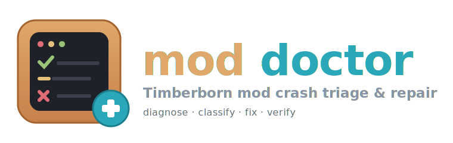

<p align="center">
  
</p>

<p align="center">
  <b>A single-file triage tool for Timberborn mod crashes.</b><br>
  Reads the game's crash reports, names the culprit mod, and safely disables or de-duplicates it &mdash; with a clickable terminal UI.
</p>

<p align="center">
  
  
  
  
</p>

---

## What it does

After a Timberborn update, one incompatible mod throws the *first uncaught exception* and the game won't load. Fix it, relaunch, and the **next** broken mod surfaces &mdash; endless whack-a-mole. `mod_doctor` ends it in one pass:

1. **Reads** the crash reports (`error-report-*.zip`) &mdash; or the live `Player.log` if you've cleared them.
2. **Classifies** each crash into a known class (see below).
3. **Resolves** the culprit against the mods the game *actually* loads (correct `version-*` folder, real `manifest.json`).
4. **Plans a safe fix** &mdash; disable a broken mod, or remove the older copy of a duplicated mod &mdash; and only performs it with `--apply`.

Plus a proactive **AssemblyRef compatibility scan** (reads each mod DLL's real assembly references, ECMA-335) that flags mods needing a game assembly your build lacks *before* the game even crashes.

> **Safe by default.** Running with no arguments is a dry run: it prints the plan and changes nothing. Nothing is ever hard-deleted &mdash; disabled mods move to `_BUG/`, duplicates and migration originals to `__archives/`, and (only with `--archive-dead`) unfixable dead packages to `__dead/`. All flat folders, all fully recoverable.

## Preview

Default run in a real terminal opens a **clickable TUI** &mdash; each finding shows only its title; click (or press `e`) to expand the detail. Piped or with `--plain` it prints a colored, numbered summary:

```text
Mods dir     : ~/Documents/Timberborn/Mods
Error reports: ~/Documents/Timberborn/Error reports
Game managed : .../Timberborn/Timberborn_Data/Managed  (found)
Game version : 1.0.13.1
Mod folders  : 84 present, 84 loaded by the game

GAME COMPATIBILITY (AssemblyRef scan)
   1. no missing GAME assembly on game 1.0.13.1
   2. soft: SomeFramework.Core missing        # lazy-bound: install that dependency mod

CRASH TRIAGE
   3. missing_asm/high - ReflectionTypeLoadException / missing assembly 'X'

ACTIONS PLANNED (dry-run; --apply to perform)
   4. will move BrokenMod -> _BUG

SUMMARY
   5. disable 1 | dedup 0 | stale 0 | manual 0 | transient 0
   6. Re-run with --apply to perform these.
```

## Install

Requires **Python 3.9+**. Diagnosis and data-only migration use the standard library
alone. Colored output and the interactive TUI are optional:

```bash
pip install rich textual
```

Compiled compatibility adapters additionally require the **.NET 8 SDK** and the full
repository checkout (the adapter sources live under `compat/`). A standalone copy of
`mod_doctor.py` still diagnoses compiled legacy mods, but cannot rebuild them.

## Usage

The one-shot force mode fixes everything fixable in a single command:

```bash
python mod_doctor.py --fix           # force mode: apply every available repair NOW
```

`--fix` (alias `--force-fix`) implies `--apply --repair-legacy --force`: it disables
crashers, deduplicates, migrates data-only legacy mods, rebuilds bundled compiled
adapters, and applies the fragile crash classes — no argument stacking. Packages
that genuinely require an author source rebuild stay reported, never faked.

Fine-grained runs when you want the dry-run-first workflow:

```bash
python mod_doctor.py                 # dry run: diagnose + show the plan (TUI if interactive)
python mod_doctor.py --apply         # perform the fixes: disable -> _BUG, dedup -> __archives
python mod_doctor.py --repair-legacy   # dry run: plan safe TimberAPI -> native migrations
python mod_doctor.py --apply --repair-legacy   # migrate supported data and compiled mods
python mod_doctor.py --plain         # colored, non-interactive summary (titles only)
python mod_doctor.py --plain --details   # ...with every finding's detail expanded
python mod_doctor.py --tui           # force the interactive collapsible TUI
python mod_doctor.py --reports 1     # only triage the newest crash report
python mod_doctor.py --force         # also auto-apply the fragile crash classes
```

In the TUI: **click a row** (or `e`/`c`) to expand/collapse, `q` to quit.

### Flags

| Flag | Effect |
|---|---|
| `--apply` | Perform the planned moves and migrations (default is a dry run). |
| `--fix` / `--force-fix` | One-shot force mode: `--apply --repair-legacy --force` combined. |
| `--repair-legacy` | Convert supported data-only TimberAPI packages and rebuild bundled compiled adapters against the installed game's DLLs. With `--apply`, archives the original and creates a separate current-version package. Unknown compiled mods remain report-only. |
| `--archive-dead` | Explicit opt-in: park UNFIXABLE, unloadable legacy packages (abandoned upstream, no migration path) into `__dead/`. Never part of `--fix`. In the TUI this is the **ARCHIVE DEAD PACKAGE(S)** button. |
| `--plain` / `--tui` | Force plain output / the interactive TUI (default: TUI when the terminal is interactive). |
| `--details` | In plain mode, print each finding's detail (default: titles only). |
| `--reports N` | Only the N most recent crash reports (0 = all). |
| `--no-dedup` / `--no-crash` | Skip duplicate cleanup / crash triage. |
| `--force` | Also auto-apply low-confidence classes (spec-key, missing-method). |
| `--mods PATH` | Timberborn Mods dir (overrides auto-detection). |
| `--game PATH` | Timberborn install or its `Managed` dir (overrides auto-detection). |

### Legacy TimberAPI repair

`--repair-legacy` performs real format/source migrations, not manifest renames. Every
output targets the exact installed build.

For data-only packages, it reads the installed game's `Blueprints.zip`, translates
supported needs, goods, recipes, faction collections, and manufactory recipe patches,
preserves texture bundles, and deduplicates definitions shared by several packages.

For known compiled packages, it builds the bundled adapter source against the installed
`Managed` DLLs. The current adapters restore:

- **Draggable Utilities** &mdash; pause/resume, prioritize/deprioritize haulers, and
  empty/unempty storage across dragged selections.
- **Growth Overlay** &mdash; hold `Tab` to show growth percentages for growable natural
  resources, including post-growth yield progress.

| Legacy package | Result |
|---|---|
| Data-only `Specifications` | Converted to native `.blueprint.json` files under `version-<major.minor>` (e.g. `version-1.0`), with `MinimumGameVersion` set to the exact installed build |
| Legacy TimberAPI asset bundle | Omitted (old Unity bundles fail on 1.x); icons are remapped to built-in game sprites |
| Draggable Utilities / Growth Overlay `EntryDll` | Rebuilt from bundled adapter source against the installed game assemblies |
| Other compiled `EntryDll` using removed APIs | Reported as requiring a source rebuild; never exposed to the native loader |
| Bundle containing serialized GameObjects/scripts | Reported as requiring a current Unity/source rebuild |

The original package moves to `__archives/` (flat &mdash; no dated subfolders). The migrated package uses a
separate `__mod_doctor_1.0` folder so a Steam/mod.io re-download cannot overwrite it.
Disable or unsubscribe from the obsolete synced package to stop that old copy from
returning.

### Path detection

`mod_doctor` finds your install automatically, in priority order:

- **Mods dir:** `$TIMBERBORN_MODS` &rarr; the current directory if it looks like a Mods folder &rarr; `~/Documents/Timberborn/Mods`.
- **Game dir:** `$TIMBERBORN_GAME` &rarr; the `Mono path[0]` the game recorded in its logs &rarr; common Steam library locations.

If your `Documents` folder is redirected, run the tool from inside your Mods folder, pass `--mods`, or set `TIMBERBORN_MODS`.

## Crash classes it recognizes

| Class | Signature | Typical fix |
|---|---|---|
| **Harmony patch/transpiler** | `Failed to apply <X> transpiler` / `Patching exception` | Relocate; wait for an updated build (the mod is named in the trace). |
| **Missing assembly** (`ReflectionTypeLoadException`) | `Could not load file or assembly '<Name>'` from `GetModStarters` | Install the `RequiredMods` dependency, or relocate the dependent. |
| **Changed game API** (`MissingMethodException`) | `Method not found: <ret> <Type>.<Method>(...)` | Relocate; the mod was built against a different game build. |
| **Blueprint spec-key** (`ArgumentException`) | `No type found for key <XxxSpec>` | Delete the stale key from the blueprint JSON (durable installs only), else relocate. |
| **Duplicate mod Id** | `An item with the same key has already been added. Key: <Id>` via `ToDictionary` | Keep the higher loadable version, archive the other. |
| **Version mismatch** (AssemblyRef scan) | a mod needs a `Timberborn.*` assembly your build lacks | Align the game version; don't disable foundational mods. |

## How it stays safe

- **Cascade guard** &mdash; never auto-disables a mod that other active mods list in `RequiredMods` (foundational deps like a UI framework); it reports instead.
- **Confidence gate** &mdash; auto-applies only high-confidence classes; fragile ones are report-only unless `--force`.
- **Sync awareness** &mdash; flags Steam/mod.io-synced mods, which re-download on launch unless you also unsubscribe in-game.
- **Correct load model** &mdash; mirrors the game's own loader: a mod loads from the highest `version-*` folder whose version is `<=` your game, from a real `manifest.json`; dormant/`mod.json`-only/external (BepInEx) folders are recognized and left alone.
- **Legacy migration gate** &mdash; data transforms only when the 1.x representation is deterministic; compiled code is rebuilt only through a named, source-controlled adapter. Unknown DLLs and serialized GameObjects remain report-only.

## How it works (internals)

- Crash text is matched to a class, then the culprit is resolved against **loaded** mod DLLs only (not dormant `version-*` dirs), using distinctive type/assembly names from the game's own metadata.
- The compatibility scan parses each DLL's **AssemblyRef table** directly (a compact ECMA-335 reader) &mdash; authoritative, unlike a byte-substring, and it never mistakes a namespace string for an assembly.
- The game version is read from `Timberborn_Data/StreamingAssets/version.txt` (authoritative), falling back to the crash reports.

## License

MIT &mdash; see [LICENSE](LICENSE).

> Not affiliated with Mechanistry. "Timberborn" is a trademark of its respective owner. This is a fan-made, unofficial tool.
